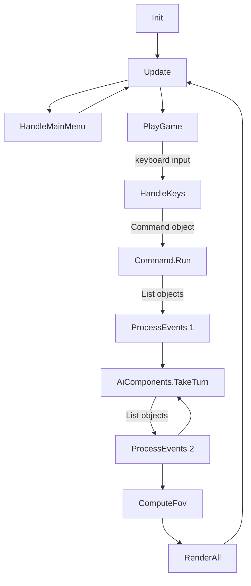

```mermaid
graph TD
    Init-->Update
    Update-->HandleMainMenu-->Update
    Update-->PlayGame--keyboard input-->HandleKeys--Command object-->Command.Run--List<Event> objects-->PE1[ProcessEvents 1]-->AiComponents.TakeTurn--List<Event> objects-->PE2[ProcessEvents 2]-->ComputeFov-->RenderAll-->Update
    PE2-->AiComponents.TakeTurn
```